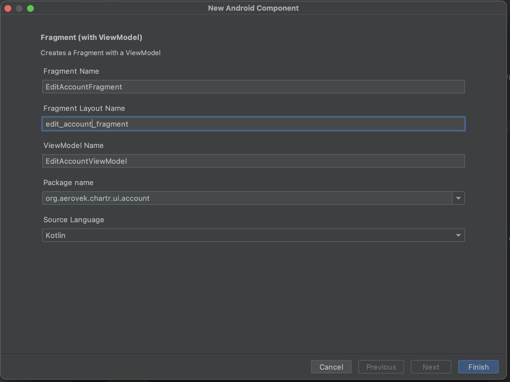

# Developer Guide

## Overview
This document will serve to help developers wanting to contribute to the project by covering things like app architecture, third party libraries used for major functions, as well as how the app interacts with the Elrond blockchain.

## Coding Standards
It's highly encouraged to follow the existing coding standards which has not been formerly defined, but the project pretty much follows the [SOLID Principles](https://www.freecodecamp.org/news/solid-principles-explained-in-plain-english/) as well as the DRY (Don't Repeat Yourself) pattern. Keeping this in mind will help keep the app maintainable and easy to follow for other developers.

## Architecture Overview
The architecture is typical of your standard Android project. It also employs the factory design pattern where most objects are managed by the IoC container. It uses [Koin](https://github.com/InsertKoinIO/koin) for dependency injection. 

## Development Environment
* Android Studio

## Project Structure
The project has two modules - <i>app</i> and <i>data</i>

The app module is typical of any standard Android project. It holds all files that have to do with UI, such as fragments, layout files, view models, etc, as well as any Android specific logic such as logic that needs to interact with the Android SDK.

The data module should only be concerned with network access and data structures, or any helper code that has nothing to do with the UI. The data module should never reference anything from the app module.

## Building and Packaging
### **build.gradle**
* In the app level [build.gradle](../app/build.gradle) file under *signingConfigs* you will find the reference to the keystore details. It’s highly recommended you move the password to an environment variable, or more preferably a CI variable in your pipeline.

* Under *defaultConfig* you will find the versioning scheme using the four variables - major, minor, patch, hotfix. There’s a method in there that creates the proper version code based on those variables. Always increment prior to uploading a new build to the Google Play Console.

### **Variants and Product Flavors**
When running the app locally, it's recommended to use the *internalDebug* variant since that is already enabled for debugging and it also will be pointed at the Devnet chain. If you select *productionRelease* the app will be pointed at Mainnet so use caution when selecting this option.

### **Packaging**
To package the app to upload to the Google Play console from Android Studio follow these steps
1. From the Build menu select *Generate signed bundle/apk*
2. Select App Bundle
3. Fill in the keystore details (you can find the correct values to enter in the build.gradle file as mentioned above)
4. Choose the correct build configuration (*internalBeta* if you want the app to use devnet. *productionRelease* if you want the app to use Mainnet)
5. Open the Event Log and click the *Locate* link to find the aab file you just built

## UI
* [DataBinding](https://developer.android.com/topic/libraries/data-binding) is used for most, if not all, layouts
* RecyclerViews use [Groupie](https://github.com/lisawray/groupie) which makes for seamless recycler view setups

### **Notes on Groupie**

Groupie is a simple, flexible library for complex RecyclerView layouts. 

It’s important to call out a few gotchas when using this library. Let’s take a look at an example that already exists in the app — the *Transaction History screen*. These are the files involved:
* [TransactionHistoryFragment](../app/src/main/java/org/aerovek/chartr/ui/wallet/transaction/TransactionHistoryFragment.kt)
* [TransactionHistoryViewModel](../app/src/main/java/org/aerovek/chartr/ui/wallet/transaction/TransactionHistoryViewModel.kt)
* [TransactionItemViewModel](../app/src/main/java/org/aerovek/chartr/ui/adapterItems/viewmodels/TransactionItemViewModel.kt) - instead of setting several variables in the *data* block of the layout file, this single object has all the data we need, then our data labels bind to the properties in this class
* [TransactionItem](../app/src/main/java/org/aerovek/chartr/ui/adapterItems/TransactionItem.kt) is responsible for binding the data for each individual transaction item, and is required for Groupie configuration (explained below in more detail)
* [transaction_item.xml](../app/src/main/res/layout/transaction_item.xml) - the layout file for our transaction item

The fragment will set up the recyclerView that will display all our transactions, and all we need to do is create a layout manager and set the adapter to a ```GroupAdapter<GroupieViewHolder>```. This will work in most cases, more complicated recycler view layouts might require more setup.
```
private fun setupRecyclerView(recyclerView: RecyclerView) {
   recyclerView.apply {
       layoutManager = LinearLayoutManager(
            requireContext(),
            LinearLayoutManager.VERTICAL, false
       )
       adapter = GroupAdapter<GroupieViewHolder>()
   }
}
```

The view model retrieves the transaction data from the blockchain and builds a list of TransactionItemViewModel objects with the data we want to display in each adapter item. The view model sends that list back to the fragment and here’s what happens next…

The groupie adapter needs to work with something called a BindableItem class. So we create our own TransactionItem class that extends ```BindableItem<TransactionItemBinding>```, then override the required methods:

* ```bind()``` - use this method to set variable values in your xml layout, in this example we have a “vm” variable that we set the TransactionItemViewModel to. You can also change UI state directly via the viewBinding object passed in. In this example I change the transaction status label text color based on the transaction status value

* ```getLayout()``` - this should return the xml layout file for the transaction item
* ```initializeViewBinding()``` - this should return the result of DataBindingUtil.bind(view)

TransactionItemBinding is a generated class that represents our layout file, same as our fragment bindings. So the layout xml file needs to be created first before the TransactionItem class can be finished otherwise the TransactionItemBinding would not exist yet.

Back to the fragment. Once we have the TransactionItem class filled out, we map the list of TransactionItemViewModel objects sent back to the fragment into a new list of TransactionItem objects and that list is what we ultimately set the recyclerView’s data items with.

```
viewModel.transactionItemModels.observe(viewLifecycleOwner) { models ->
    val items = models.map {
        TransactionItem(requireContext(), it)
    }

    binding.recyclerView.setDataItems(items)
    viewModel.showLoading.postValue(false)
    binding.swipeRefreshLayout.isRefreshing = false
}
```

### **Dependency Injection**
Refer to [AppModules](../app/src/main/java/org/aerovek/chartr/AppModules.kt) to see how we set up our dependency structure. For example, we register view models using the viewModel dsl extension and pass whatever dependencies we need into the view model constructor (such as repository interfaces). The view model instance can then be referenced in the associated fragment like this:
```
    private val viewModel: CreateAccountViewModel by inject()
```

### **Activities and Fragments**

The Chartr app is a single activity app, meaning there is only the MainActivity. Well sort of, the onboarding flow uses its own activity but once onboarding is done that activity finishes and the rest of the app uses the MainActivity throughout. So since onboarding is done only once for a user (as long as they complete it without force quitting the app) after they install the app, I still consider it a single activity app.

With that said, each screen should have its own fragment and view model class. So when creating a new fragment select the option with viewmodel as shown below  

Also DO NOT name the layout like “fragment_edit_account” because the databinding framework will generate classes that represent this layout and you will be referencing these classes in code, so you don’t want to generate a class called “FragmentEditAccountBinding”. Instead, name it something like “edit_account_fragment” so you’ll end up with a generated binding class called “EditAccountFragmentBinding” which is more readable and intuitive.

### Asynchronous Operations
When making network calls or performing any long running asynchronous operation, always use the [DispatcherProvider](../app/src/main/java/org/aerovek/chartr/util/DispatcherProvider.kt) implementation with the ```viewModelScope.launch``` call to run a coroutine in the background. This allows you to easily specify which thread you want to run that block of code on (UI thread vs background thread). There are plenty of examples in the code on how to do this properly. 

For example, this line will run the code block in a background thread
```
viewModelScope.launch(dispatcherProvider.IO)
```

While this will run the block on the main UI thread
```
viewModelScope.launch(dispatcherProvider.MAIN)

```

You may find yourself needing to modify the UI within a callback that was originally executed on the IO thread, in which case you need to launch a new routine on the MAIN thread and within that block you can access the UI without the OS barfing on you.


### **Making network calls from the UI**

Network calls need to be done inside a coroutine as mentioned above. They should always be done from a view model class and from there call the appropriate repository implementation. There are some exceptions where you find you need to run something in the background from a fragment, in that case you just need to reference the viewModelScope off the viewModel instance in your fragment. Something like ….

```
homeViewModel.viewModelScope.launch(dispatcherProvider.IO) {
   // Do Something
}

```

The call hierarchy for making network calls should go like this:
* ViewModel -> Repository -> Service -> REST client

The view model has an instance of whatever repository you want to use passed in its constructor via dependency injection. The repository in turn uses the correct service class passed into its constructor (ElrondApiService as an example) and that in turn calls the REST client get or post methods.

### **Navigation**
Navigation between fragments is configured in [nav_graph.xml](../app/src/main/res/navigation/nav_graph.xml).  If you need to navigate from a view model, there is an easy way to do it:
From your view model class, create an event your fragment can subscribe to as follows:

```
private val _navigationEvent = LiveEvent<NavigationEvent>()
val navigationEvent: LiveData<NavigationEvent> = _navigationEvent
```

In the same view model file, add this logic wherever you want to trigger a navigation somewhere

```
_navigationEvent.postValue(NavigationEvent.Directions(
   SecretPhraseFragmentDirections.actionSecretPhraseToVerifyWordsFragment()
))
```
So in this example we are navigating from the “secret phrase” fragment to the “verify secret phrase” fragment.
In your fragment, override the ```onViewCreated()``` method and subscribe to the event above, something like this:

```
override fun onViewCreated(view: View, savedInstanceState: Bundle?) {
   super.onViewCreated(view, savedInstanceState)
   viewModel.navigationEvent.observe(viewLifecycleOwner,
        NavigationObserver(NavHostFragment.findNavController(this@SecretPhraseFragment))
)}
```

So where did the *SecretPhraseFragmentDirections* class come from? That class was generated based on the *action* block you define in the nav_graph.xml file, in conjunction with the element IDs.

## Data Module

The data module consists of all the logic that knows nothing about the UI or anything about Android in general. Theoretically this data module can be plugged into another android app with little to no modifications. 

I had plans to make this its own github public repository, eventually it probably should be.

### **Dependency Injection**
Refer to the [DataModules](../data/src/main/java/org/aerovek/chartr/data/di/DataModules.kt) class. This is where we create singletons of our repository, service, and http client classes. The logic in here is much more complicated than the AppModules.kt class above, particularly the networkModule block.  

The main idea is that we inject the correct [RestClient](../data/src/main/java/org/aerovek/chartr/data/network/RestClient.kt) instance with the baseUrl for whatever service we are using. 
For example, the Elrond Gateway service has a different base URL than the Elrond API service. So if we want to call an endpoint on the Elrond API, we use the [ElrondApiService](../data/src/main/java/org/aerovek/chartr/data/network/ElrondApiService.kt) class which is set up to accept the proper restClient instance that has the elrond API baseUrl.  That way we only have to have one HTTP client class (the RestClient.kt class) to make all our web service calls in a generic fashion.

### **Repositories**
Repositories should be the only access point for making network calls from the UI. The interfaces are public but not their implementations, which is important to note because you can’t actually create a new instance of a repository concrete class from within the app module because they are marked internal, the interface has to be injected into whatever UI file you need to use it in, then it gets resolved into its concrete implementation by Koin whenever we ask for an instance of it.

All repositories are registered in the Koin IoC container, as mentioned above. All repositories in turn need to inject the proper service class in their constructor, again that is configured in the IoC container in DataModules.kt

The repositories should also be responsible for most of the business logic, doing null checks, catching exceptions, etc, and returning the correct data back to the UI.

This extra layer of separation between the repository and service classes also allows for better unit testing, something this library desperately needs.

### **Service Classes**
Service classes are responsible for simply calling the GET/POST methods in the RestClient.kt class. As mentioned earlier, each service class is set up in the DataModules.kt class with the baseUrl already. So depending on the service class you want to use, it will have the correct instance of RestClient passed into the constructor. 

* [ElrondGatewayService](../data/src/main/java/org/aerovek/chartr/data/network/ElrondGatewayService.kt) has specific methods for calling endpoints on the [elrond gateway](https://docs.multiversx.com/sdk-and-tools/rest-api/gateway-overview) (base url of https://gateway.elrond.com), while ElrondApiService has specific methods for calling endpoints that only exist on the [elrond API](https://docs.multiversx.com/sdk-and-tools/rest-api/multiversx-api) (base url of https://api.elrond.com)
* [AeroPlaidService](../data/src/main/java/org/aerovek/chartr/data/network/AeroPlaidService.kt) - this was meant to be used with our Plaid backend, a NodeJS backend I built for use with the [Plaid services](https://plaid.com/) This was POC’d out on iOS but not Android. This may no longer be the viable option for Chartr but it was the direction we were going.
* [AviationEdgeService](../data/src/main/java/org/aerovek/chartr/data/network/AviationEdgeService.kt) - This service doesn’t do anything yet, but was meant to query aircraft data via the [Aviation Edge API](https://aviation-edge.com/aviation-api-list/)
* [PrimeTrustService](../data/src/main/java/org/aerovek/chartr/data/network/PrimeTrustService.kt) This was meant to be used in conjunction with Plaid for the financial piece of Chartr - [see more](https://plaid.com/docs/auth/partnerships/prime-trust)

### **RestClient.kt**
The first thing you’ll notice is that there are two different versions of get and post methods apiGet() and apiPost() vs gatewayGet() and gatewayPost(). This is because the JSON response structure is different between the Gateway and the API, so it was easier to just create two different versions for each. This can definitely be improved but it works. 

### **ErdKotlin**
Most of the Elrond specific logic, such as data structures, cryptographic functions, etc,  was taken from the [ErdKotlin](https://github.com/ElrondNetwork/elrond-sdk-erdkotlin) repo and restructured to fit our architecture better. Since it’s not actively maintained, I pulled the necessary pieces out and added the code to our data module so we can maintain it ourselves.

Note the *elrondsdk.usecase* package. This may have some helpful functions to use later, but note the deprecated warnings on all of the classes in there. Do not use these classes, they need to be converted into a repository class and set up like all the other repository classes so it fits the Chartr architecture.


## Resources
* https://docs.elrond.com/sdk-and-tools/rest-api/rest-api/
* https://docs.elrond.com/sdk-and-tools/rest-api/gateway-overview/
* https://docs.elrond.com/sdk-and-tools/rest-api/api-elrond-com/
* https://developer.android.com/studio/build/build-variants#sourcesets
* https://kotlinlang.org/docs/reference/coroutines/flow.html
* https://github.com/bumptech/glide
* https://developer.android.com/training/camerax
* https://developer.android.com/jetpack/androidx/releases/navigation
* https://github.com/lisawray/groupie
* https://square.github.io/okhttp/
* https://github.com/InsertKoinIO/koin
